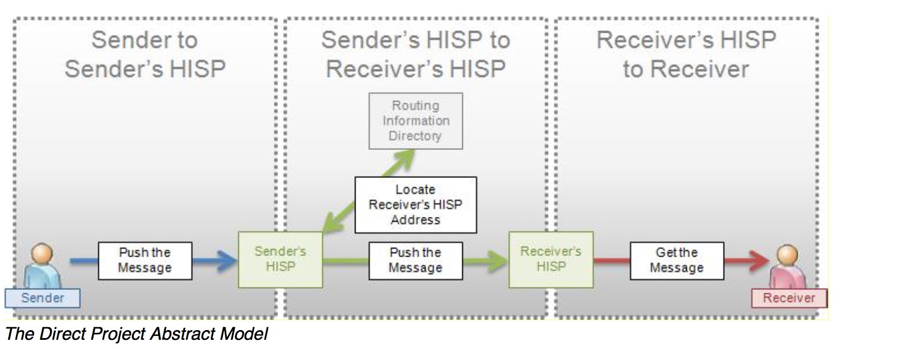

## 背景介绍

以往在美国大量的医生之间的沟通交流病人的病历资料是通过传真和邮箱来实现的。Direct 项目旨在提出一种更加快捷、安全和低成本的传输方式来
让患者和医生医疗机构受益。这里面有三点 ：第一点是对发送和接收方的身份验证、二是要传输的医疗信息的加密、三是接收方、发送方互相 了解并信任对方。

## 前提条件

1、发送方在数据发送之前负责获取数据使用的用户授权，方式不限(比如说纸质材料或者传真的方式，这类方式统称为带外方式)
2、该项目遵循相关法律政策的要求
3、按照法律要求，发送方必须在获取了患者授权之后才能发送信息给接收方
4、发送方负责确保通过带外方式传输信息给接收方从法律上和临床上都是合适的
5、发送方负责确保接收方的地址是正确的
6、发送方与接收方之前就信息交换的目的进行过沟通(可能采用的带外方式)，
7、发送双方不要求有统一的患者标识

##  解决问题的范围

1、Direct 不能解决复杂场景下的问题，比如说急诊室接收到昏迷患者时，急诊室医生必须从任意的可以获取医
疗数据的来源进行查找和发现倒地是否存在该病人相关的病历(这是一种主动pull的模式)。Direct适合push的场景
2、Direct 关注的信息的传输，也就是发送双方如何发送、接收消息，至于说交换内容的格式和结构要依赖CCD(类似于国内的健康档案/电子病历共享文档规范)，数据中使用的
标化字典用哪些，它是管不了的。

## 常见的应用场景

可以是任意的居民、机构、医生之间点到点的直接的通信。可以适用于一体式的电子健康档案系统、某个电子健康档案系统模块
、个人健康记录系统其他如邮件客户端或者浏览器。人为参与可能存在于收发两端，例如
1、医生A写了一封电子邮件给另外一个医生B，附件中包含了一份病历，医生B收到邮件并打开了附件
2、电子健康档案系统自动生成了一条消息发送给患者，患者打开并读取了消息的内容
3、电子健康档案系统自动的与区域平台或其他电子健康档案系统进行通信，并存储通信的消息内容

### 第一类
1、全科医生D1将患者转诊至某专科医生D2，并把患者的病历摘要发送给D2
2、全科医生D3将患者转诊至某医院H1，并把患者的病历摘要发送给医院H1
3、专科医生D2把患者的病历摘要返还给全科医生D1
4、医院H1把患者的出院信息返还给全科医生D3
5、检验实验室把检验结果返回给下达医嘱的医生
6、Transaction sender receives delivery receipt
7、医疗机构发送患者病历信息给患者
8、医生发送患者病历信息给患者
9、医生把患者某次门诊的摘要信息发送给患者
10、医院发送出院摘要给患者
11、医生发送一条随访提醒给患者
12、全科医生将患者的免疫接种信息上报给公共卫生部门

### 第二类
1、医生或医疗机构将质控指标上报至行政管理部门
2、医生或医疗机构将质控指标上报至疾控中心
3、实验室将特殊疾病的检验结果上报至公共卫生部门
4、医生或医疗机构将主诉信息上报至公共卫生部门
5、药房将药物治疗管理资讯信息发送给全科医生
6、由患者制定的医务人员监控和协调他的诊疗服务
7、电子病历系统下达了检验医嘱
8、患者发送一条消息给医疗机构

### 第三类
1、Transaction sender receives read receipt
2、省级公共卫生部门将公共卫生数据上报至国家级

## 要解决的四大需求
1、唯一的标识信息的收发双方
2、发送方要能够发送信息
3、健康信息和临床信息的分别路由
4、建立和确认收发双方信任的安全手段，保护传输信息泄露的安全手段

## Direct抽象模型

HISP(健康信息服务提供者)，负责将信息以消息的形式从发送方传输到接收方，它是一个逻辑概念并非业务、技术实体。

### 第一例：全科医生D1将患者转诊至某专科医生D2，并把患者的病历摘要发送给D2

#### 1、从发送方到发送方的HISP
全科医生Dr wells要将患者转诊至一个肠胃学的专科医生Dr aye，希望Dr aye能够了解患者的一些基本信息。 Dr wells使用电子病历系统生成一份患者的病历摘要
并将病历摘要通过Dr aye之前告诉她的Direct地址发送给Dr aye。Dr wells的电子病历系统通过认证，确认了Dr wells的HISP的身份信息，然后将数据(消息以及病历)打包加密
push给Dr wells的HISP。

#### 2、从发送方的HISP到接收方的HISP
Dr wells的HISP在定位了Dr aye的HISP地址之后，先进行Dr aye的HISP的身份认证，消息加密、消息传输直到Dr aye的HISP接收到消息。

#### 3、从接收方的HISP到接收方
Dr aye医生并没有电子病历系统，它是使用电子邮件软件来处理加密消息的。Dr aye的电子邮件软件认证了Dr aye的HISP的身份并拿到了消息，
收件箱里便显示一份新邮件。Dr aye医生留意到有一份Dr wells医生发来的邮件，通过电子邮件软件自带的打开加密邮件的流程查看到了患者的疾病、用药、
过敏和最近所做的检查检验项目。

### 第二例：医疗机构发送患者病历信息给患者

#### 1、从发送方到发送方的HISP
患者M最近刚在医院H住了院，他想拿到一份自己临床信息和出院摘要的副本。他申请将这些信息发送到他的个人健康档案系统(PHR)中，
给了Direct的地址：m.powered@SuperPHR.com。医院H的医生使用医院的电子病历系统，选好了要发给病人的文档，
其中包含了病案首页和出院摘要，填好了患者的Direct地址，发送了一条消息(附件就是前面提到的文档)。

#### 2、从发送方的HISP到接收方的HISP
医院的电子病历系统是托管在供应商的数据中心，系统自带HISP功能，在定位了SuperPHR系统的HISP地址之后，先进行SuperPHRHISP的身份认证，
消息加密、消息传输直到 SuperPHR 的HISP接收到消息。

#### 3、从接收方的HISP到接收方
接收端并不存在人为干预，患者的PHR个人健康档案系统也是托管在数据中心的，SuperPHR系统的HISP接收到消息之后，将消息分发到具体的患者的记录当中。
PHR系统从消息中解压出病历数据，解密，并将数据保存至患者的“收到的病历”文件夹(与m.powered@SuperPHR.com对应的)中，患者在登录了SuperPHR的系统之后，可以查看文档，
也可以从病案首页中选择部分数据导入到自己的PHR之中。

## 所涉及的技术
主要是消息内容打包、加密解密和传输
1、内容打包使用MIME，或者IHE XDM(通过邮件传输.ZIP包)
2、通过S/MIME加密和签名来保证内容的保密性和完整性
3、使用X.509数字证书来对收发双方进行身份认证
4、通过SMTP来处理消息路由

参考：
1、out-of-band
>传输层协议使用带外数据（out-of-band，OOB）来发送一些重要的数据，如果通信一方有重要的数据需要通知对方时，协议能够将这些数据快速地发送到对方。
为了发送这些数据，协议一般不使用与普通数据相同的通道，而是使用另外的通道。linux系统的套接字机制支持低层协议发送和接受带外数据。
但是TCP协议没有真正意义上的带外数据。为了发送重要协议，TCP提供了一种称为紧急模式（urgent mode）的机制。
TCP协议在数据段中设置URG位，表示进入紧急模式。接收方可以对紧急模式采取特殊的处理。
很容易看出来，这种方式数据不容易被阻塞，并且可以通过在我们的服务器端程序里面捕捉SIGURG信号来及时接受数据。这正是我们所要求的效果。
2、S/MIME
>安全的多用途Internet邮件扩展（Secure Multipurpose Internet Mail Extensions，简称S/MIME）是一种Internet标准，它在安全方面对MIME协议进行了扩展，可以将MIME实体（比如数字签名和加密信息等）封装成安全对象，为电子邮件应用增添了消息真实性、完整性和保密性服务。S/MIME不局限于电子邮件，也可以被其他支持MIME的传输机制使用，如HTTP。
S/MIME（安全/多用途 Internet 邮件扩展）是被广泛接受的用于发送数字签名和加密邮件的方法，或者更确切地说是一种协议。S/MIME 允许您加密电子邮件，并对它们进行数字签名。当您在电子邮件中使用 S/MIME 时，可帮助接收邮件的用户确信他们在收件箱中看到的邮件就是发件人发出的邮件。它还能帮助接收邮件的用户确信邮件来自特定的发件人，而不是冒充此发件人的人。为此，S/MIME 提供了加密安全服务，例如身份验证、邮件完整性和防发送方抵赖（使用数字签名）。它还有助于增强电子邮件的隐私和数据安全（使用加密）。有关电子邮件环境下 S/MIME 的历史记录和体系结构的完整背景，请参阅了解 S/MIME。

3、IHE XDM
>Cross-Enterprise Document Media Interchange (XDM) - provides document interchange using a common file and directory structure over several standard media. This permits the patient to use physical media to carry medical documents. This also permits the use of person-to-person email to convey medical documents.

>The IHE Cross-Enterprise Document Media Interchange integration profile, a specification for the exchange of electronic health record documents on portable media. XDM provides an option for zipped file transfer over e-mail, which is very relevant to the Direct Project specifications.

>Facilitates person-to-person exchange of the healthcare information
    supports transport via physical media - USB and CD-R
    supports transport as an attachment to an email

>        DICOM PS 3.10 Media Storage and File Format for Data Interchange (DICOM file format). http://dicom.nema.org/
        DICOM PS 3.12 Media Formats and Physical Media for Data Interchange, Annex F - 120mm CD-R media, Annex R - USB Connected Removable Devices, Annex V - ZIP File Over Media, and Annex W - Email Media. http://dicom.nema.org/
        XHTML™ 1.0 The Extensible HyperText Markup Language (Second Edition). A Reformulation of HTML 4 in XML 1.0. W3C Recommendation 26 January 2000, revised 1 August 2002. http://www.w3.org/TR/xhtml1.
        XHTML™ Basic. W3C Recommendation 19 December 2000. http://www.w3.org/TR/xhtm-basic.
        MDN: RFC 3798 Message Disposition Notification. http://www.rfc-editor.org/rfc/rfc3798.txt
        ebRIM OASIS/ebXML Registry Information Model v3.0
        ZIP format http://www.pkware.com/support/zip-app-note/
